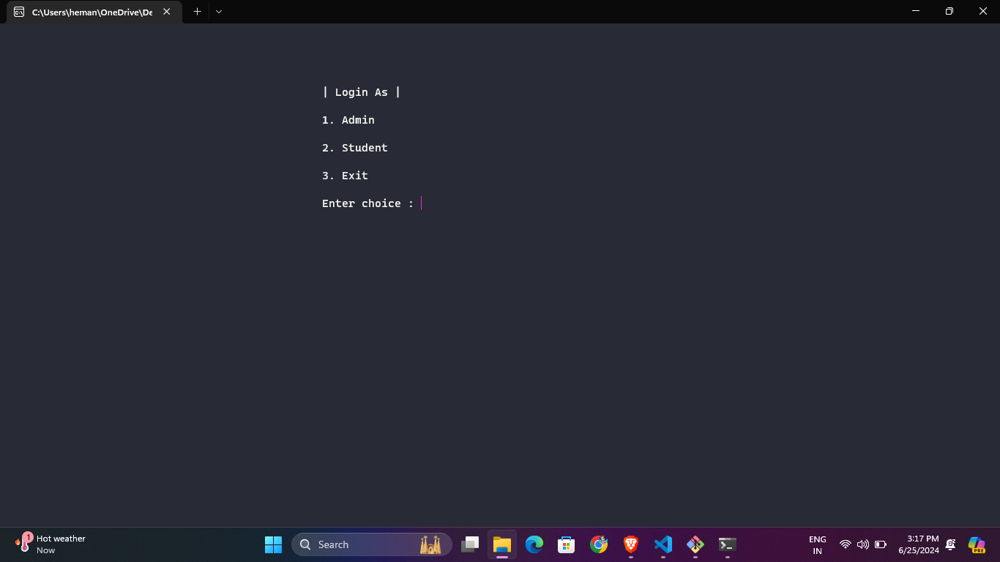
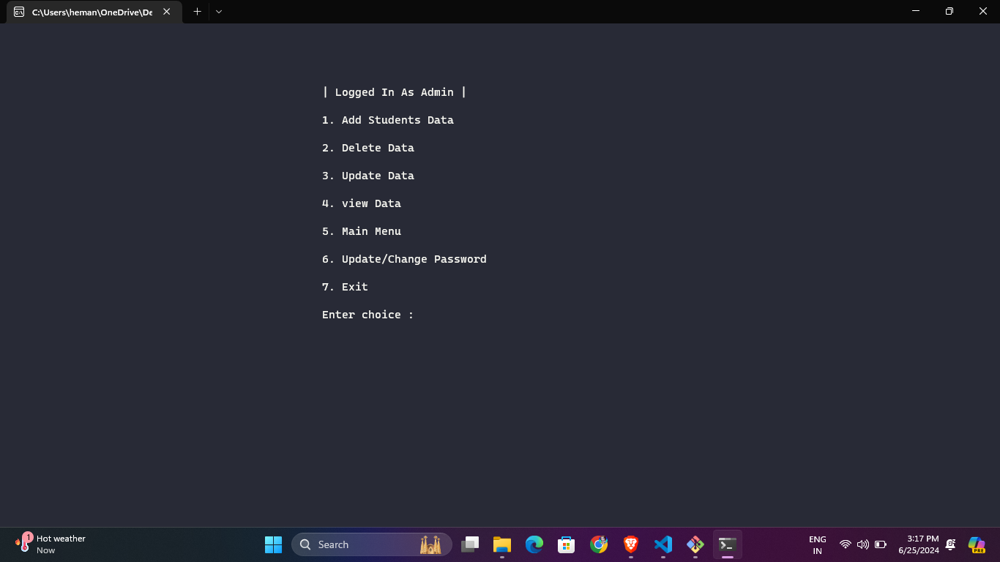
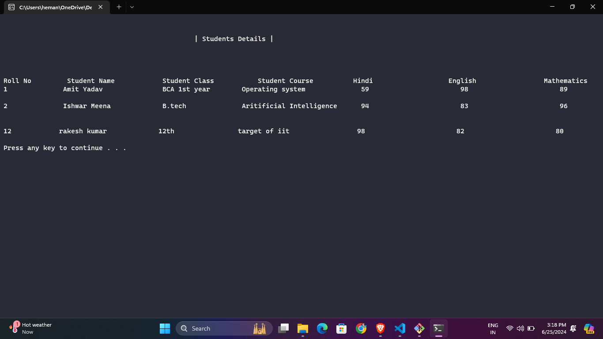

# 📚 Student Database Management System

This is a simple Student Database Management System implemented in C++. It allows users to add, delete, update, and view student data. The system provides both admin and student functionalities, with a password-protected admin section.

## ✨ Features

- **🔒 Admin Functions:**
  - ➕ Add Student Data
  - ❌ Delete Student Data
  - ✏️ Update Student Data
  - 📋 View All Student Data
  - 🔑 Change Admin Password
- **👩‍🎓 Student Functions:**
  - 👀 View Personal Data by Roll Number
- **🛡️ Security:**
  - 🔒 Password-protected admin section

## 📸 Screenshots

### 🏠 Main Menu


### 🛠️ Admin Menu


### 📋 View Data



## 🚀 Usage

### 🛠️ Prerequisites

- A C++ compiler (e.g., g++, clang++)
- `windows.h` library for Windows-specific functionality

### 🏗️ Compilation

To compile the code, use the following command (assuming you are using g++):

```bash
g++ -o student_dbms student_dbms.cpp
